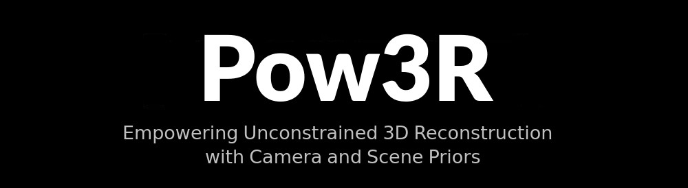
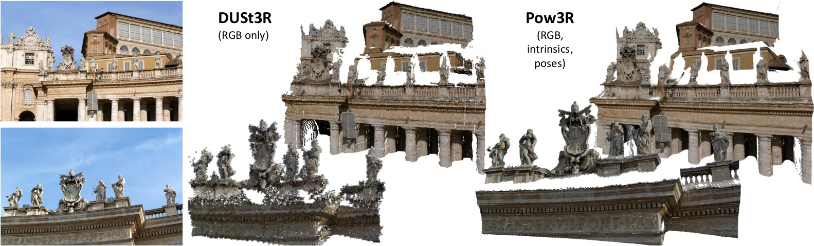
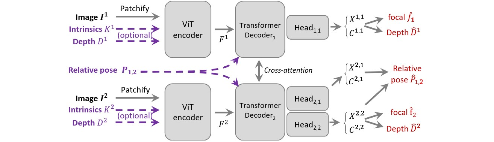

Official implementation of `Pow3R: Empowering Unconstrained 3D  Reconstruction with Camera and Scene Priors` (*CVPR 2025*)
[[Project page](https://europe.naverlabs.com/pow3r)], [[arxiv](https://arxiv.org/abs/2503.17316)]  





```bibtex
@inproceedings{pow3r_cvpr25,
      title={Pow3R: Empowering Unconstrained 3D  Reconstruction with Camera and Scene Priors}, 
      author={Wonbong Jang and Philippe Weinzaepfel and Vincent Leroy and Lourdes Agapito and Jerome Revaud},
      booktitle = {CVPR},
      year = {2025}
}
```


## Table of Contents

- [Table of Contents](#table-of-contents)
- [License](#license)
- [Get Started](#get-started)
  - [Installation](#installation)
  - [Checkpoints](#checkpoints)
- [Demo](#demo)
- [Training](#training)
  - [Notes](#notes)

## License
see [LICENSE](LICENSE)

## Get started
### Installation

```bash
micromamba create -n pow3r python=3.11 cmake=3.14.0
micromamba activate pow3r 
pip3 install torch==2.7.0 torchvision==0.22.0 --index-url https://download.pytorch.org/whl/cu126 # use the correct version of cuda for your system
pip install -r dust3r/requirements.txt
pip install -r dust3r/requirements_optional.txt
pip install -r requirements.txt

cd dust3r/croco/models/curope/
pip install .  # or python setup.py build_ext --inplace
cd ../../../../
```

### Checkpoints
We provide the pre-trained model:

| Modelname   | Training resolutions | Head | Encoder | Decoder |
|-------------|----------------------|------|---------|---------|
| [`Pow3R_ViTLarge_BaseDecoder_512_linear.pth`](https://download.europe.naverlabs.com/ComputerVision/Pow3R/Pow3R_ViTLarge_BaseDecoder_512_linear.pth) | 512x384, 512x336, 512x288, 512x256, 512x160 | Linear | ViT-L | ViT-B |

This is the same checkpoint as we used for CVPR. 

## Demo

### High-Resolution 3D reconstruction demo

We provide the code to generate the video showcasing the high-resolution capabilities of Pow3R.
```bash
python demo_high_res.py --img1 assets/img1.jpg --img2 assets/img2.jpg 
```


## Training

- [ ] TODO: release training code

